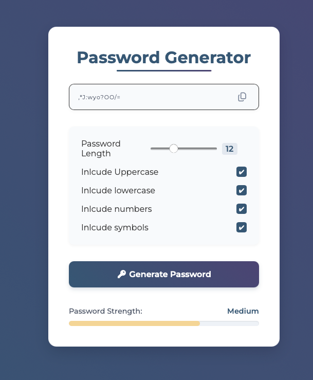

# Password Generator

A customizable password generator built with JavaScript.

## Live Demo

Try the app here: https://lavim708.github.io/Password-Generator/

## Preview

## Features

- Generate random passwords
- Choose password length
- Include uppercase letters
- Include lowercase letters
- Include numbers
- Include symbols
- Password strength feedback
- Copy generated password to clipboard

## Built With

- HTML
- CSS
- JavaScript

## What I Learned

This project helped me understand DOM manipulation, event handling, conditional logic, random value generation, regular expressions, clipboard interaction, and organizing JavaScript into reusable functions.
